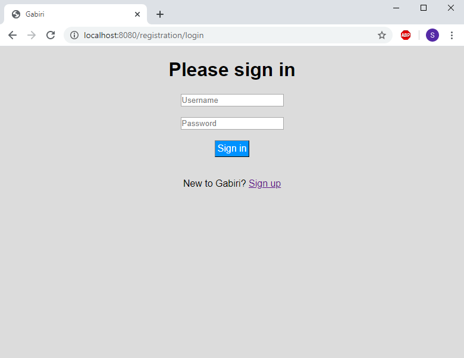

# Gabiri

Gabiri is a hiring management software. It is currently in pre-alpha.
Gabiri is Sumerian for "mountain".

## Features
With this application, you can:
* Create and delete records for positions and applicants
* Upload files (e.g. resumes or CVs) for each applicant to be displayed on their profile page
* Compare applicants for each open position
* Add and remove applicants to consideration for open positions
* Fill positions with applicants
* Retain records of applicants for positions that have been filled
* View currently open positions and currently filled positions
* View each applicant's list of positions they have applied for

### Future Features
Future releases will include:
* Options to back up data
* Integration with a calendar API
* A search function for positions and applicants
* A rating system for applications
* Pagination of all tables
* The option to choose one file for each applicant as their 'resume', which will then be displayed on the page of each position they apply to
* The ability to add short descriptions to uploaded documents
* Users only being able to see positions & applicants they created

## Prerequisites

To run this application, you will need MySQL running.

### Getting Started

 Simply change the spring.datasource.username and spring.datasource.password settings in the application.properties file to the username and password of a MySQL user with schema-creation privileges on your server. If a schema does not already exist for this application, one will be created automatically when you run it.

## Built With

* [Spring Boot](https://spring.io/projects/spring-boot) - The web framework used
* [Maven](https://maven.apache.org/) - Dependency Management
* [MySQL](https://www.mysql.com/) - The database system used
* [ThymeLeaf](https://www.thymeleaf.org/) - a template engine for the view layer.

## Screenshots

## Acknowledgments

* I'd like to thank my wonderful family, who helped me test this program, and who made this project possible at all by loving me into existence.
* Special Acknowledgments to https://www.fakenamegenerator.com/ which helped me create dummy data I used to test this project (including the data displayed in the screenshots!)
